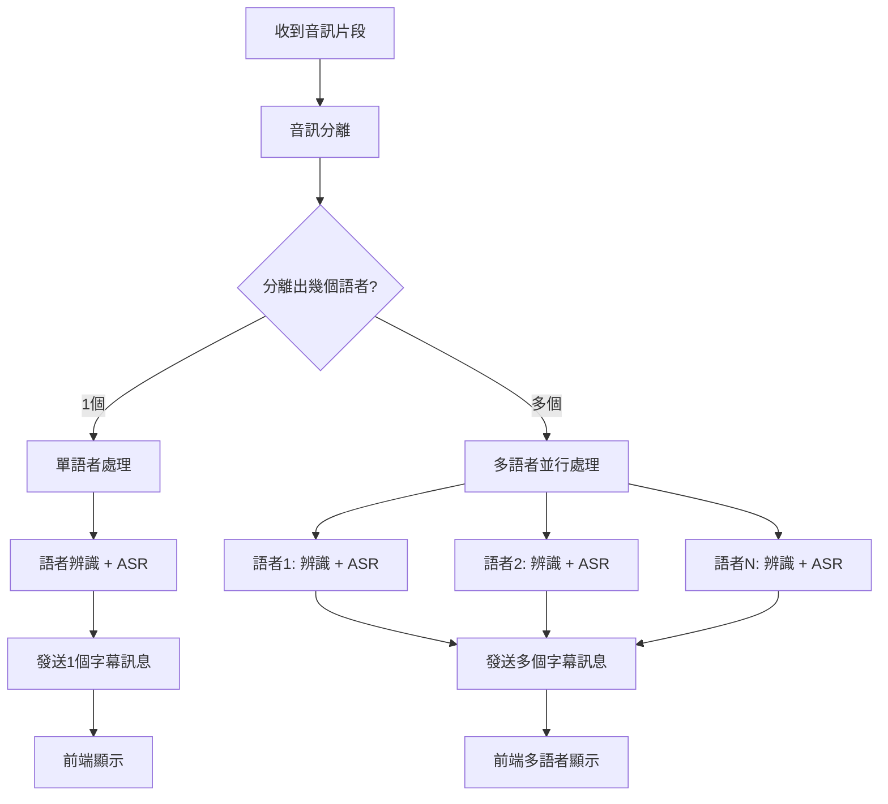

# 即時語音串流功能 - WebSocket 協議規格文件 v2.0

## 1. 概要

本功能使用 **WebSocket** 建立「雙向即時連線」，實現多語者即時語音處理：

* **前端 → 後端**：傳輸原始音訊 bytes 資料、文字控制訊號
* **後端 → 前端**：回傳每個語者的獨立字幕結果（JSON 格式，含完整時間資訊）

### 🆕 v2.0 新特性
- ✅ **多語者支援**：一個音訊片段中的每個語者都會產生獨立字幕
- ✅ **完整時間資訊**：包含相對時間和絕對時間戳
- ✅ **片段資訊**：提供語者數量和片段索引
- ✅ **增強元資料**：包含信心度、語者距離等詳細資訊

---

## 2. WebSocket 端點

```
ws://<server-host>:<port>/ws/stream?session=<UUID>
```

**必要參數：**
- `session` (query param)：會議 Session UUID，用於資料儲存和管理

---

## 3. 訊息格式規格 (Message Protocol Spec)

前端到後端使用**原始 WebSocket 格式**，後端到前端使用 **JSON 格式**。

---

### 3.1 前端 → 後端

#### (A) 傳送音訊片段

```javascript
// 直接發送原始音訊 bytes (ArrayBuffer 或 Uint8Array)
websocket.send(audioArrayBuffer);
```

**格式：** WebSocket Binary Message (bytes)
- 📦 **資料類型：** ArrayBuffer、Uint8Array 或其他二進位音訊資料
- ⚡ **優勢：** 無需 JSON 封裝，傳輸效率更高，避免重複數據問題

#### (B) 傳送停止訊號

```javascript
// 發送純文字停止信號
websocket.send("stop");
```

**格式：** WebSocket Text Message
- 📝 **內容：** 純文字字串 `"stop"`
- 🎯 **用途：** 通知後端停止處理並完成剩餘音訊

---

### 3.2 後端 → 前端

#### (A) 字幕結果 (多語者獨立傳送)

```json
{
  "type": "subtitle",
  "segmentId": "1",                    // 片段唯一 ID
  "speakerId": "speaker-uuid-123",     // 語者唯一 UUID
  "speakerName": "John",               // 語者顯示名稱
  "distance": 0.25,                    // 語者辨識距離 (0-1, 越小越準確)
  "text": "今天天氣很好",               // 轉錄文字內容
  "confidence": 0.89,                  // ASR 信心度 (0-1)
  "startTime": 0.0,                    // 語者開始時間 (相對於片段, 秒)
  "endTime": 2.5,                      // 語者結束時間 (相對於片段, 秒)
  "absoluteStartTime": "2024-01-01T10:00:00.123+08:00",  // 絕對開始時間 (ISO 8601)
  "absoluteEndTime": "2024-01-01T10:00:02.623+08:00",    // 絕對結束時間 (ISO 8601)
  "isFinal": true,                     // 是否為最終版本 (串流模式固定 true)
  "segment": {                         // 片段資訊
    "totalSpeakers": 2,                // 此片段總語者數
    "speakerIndex": 0,                 // 當前語者在片段中的索引 (0-based)
    "segmentStart": 0.0,               // 片段開始時間 (相對於錄音開始)
    "segmentEnd": 4.0                  // 片段結束時間 (相對於錄音開始)
  }
}
```

**重要說明：**
- 🎯 **一個音訊片段會產生多個字幕訊息**，每個語者一個
- 📊 **時間資訊層級**：
  - `startTime/endTime`：語者在片段內的相對時間
  - `absoluteStartTime/absoluteEndTime`：真實世界的絕對時間
  - `segment.segmentStart/segmentEnd`：片段在整個錄音中的位置

---

## 4. 前端開發教學

### 4.1 建立連線

```javascript
const sessionUUID = "your-session-uuid-here";
const ws = new WebSocket(`ws://localhost:8000/ws/stream?session=${sessionUUID}`);

ws.onopen = () => {
  console.log("✅ WebSocket 連線成功");
};

ws.onclose = (event) => {
  console.log(`🔌 WebSocket 連線關閉: ${event.code} - ${event.reason}`);
};

ws.onerror = (error) => {
  console.error("❌ WebSocket 錯誤:", error);
};
```

### 4.2 傳送音訊

```javascript
function sendAudio(audioData) {
  if (ws.readyState === WebSocket.OPEN) {
    // 直接發送原始音訊 bytes，無需 JSON 包裝
    ws.send(audioData);  // audioData 應該是 ArrayBuffer 或 Uint8Array
  }
}

// 範例：從麥克風捕獲音訊並發送
function startRecording() {
  navigator.mediaDevices.getUserMedia({ audio: true })
    .then(stream => {
      const mediaRecorder = new MediaRecorder(stream);
      mediaRecorder.ondataavailable = (event) => {
        if (event.data.size > 0) {
          // 將 Blob 轉換為 ArrayBuffer 後發送
          event.data.arrayBuffer().then(buffer => {
            sendAudio(buffer);
          });
        }
      };
      mediaRecorder.start(100); // 每 100ms 發送一次
    });
}
```

### 4.3 停止錄音

```javascript
function stopRecording() {
  if (ws.readyState === WebSocket.OPEN) {
    // 發送純文字停止信號
    ws.send("stop");
    console.log("🛑 已發送停止信號");
  }
}
```

### 4.4 接收多語者字幕

```javascript
const subtitles = new Map(); // 存儲字幕資料

ws.onmessage = (event) => {
  const msg = JSON.parse(event.data);
  
  if (msg.type === "subtitle") {
    console.log(`📝 收到字幕 [${msg.segment.speakerIndex + 1}/${msg.segment.totalSpeakers}]:`, msg);
    
    // 建立唯一 ID
    const subtitleId = `${msg.segmentId}-${msg.speakerId}`;
    
    // 顯示字幕
    displaySubtitle({
      id: subtitleId,
      speaker: msg.speakerName,
      text: msg.text,
      confidence: msg.confidence,
      startTime: msg.absoluteStartTime,
      isMultiSpeaker: msg.segment.totalSpeakers > 1
    });
    
    // 儲存到 Map
    subtitles.set(subtitleId, msg);
  }
};

function displaySubtitle(subtitle) {
  const container = document.getElementById("subtitles");
  const existing = document.getElementById(subtitle.id);
  
  if (!existing) {
    const el = document.createElement("div");
    el.id = subtitle.id;
    el.className = "subtitle-item";
    
    // 多語者顯示不同顏色
    if (subtitle.isMultiSpeaker) {
      el.style.borderLeft = `4px solid ${getSpeakerColor(subtitle.speaker)}`;
    }
    
    el.innerHTML = `
      <div class="speaker-info">
        <strong>${subtitle.speaker}</strong>
        <span class="confidence">${(subtitle.confidence * 100).toFixed(1)}%</span>
        <span class="time">${new Date(subtitle.startTime).toLocaleTimeString()}</span>
      </div>
      <div class="text">${subtitle.text}</div>
    `;
    
    container.appendChild(el);
  }
}

function getSpeakerColor(speakerName) {
  const colors = ['#FF6B6B', '#4ECDC4', '#45B7D1', '#FFA726', '#AB47BC'];
  const hash = speakerName.split('').reduce((a, b) => a + b.charCodeAt(0), 0);
  return colors[hash % colors.length];
}
```

---

## 5. 完整範例訊息流程

### 5.1 單語者場景

```plaintext
前端                                後端
 │
 ├─ send: [bytes] 音訊資料              ──▶ 處理音訊片段
 ├─ send: [bytes] 音訊資料              ──▶ (語音分離 + 辨識 + 轉文字)
 │
 ◀── receive: {                             ──┤ 
       "type": "subtitle",                    │
       "segmentId": "1",                      │ 只有一個語者
       "speakerId": "uuid-john",              │
       "speakerName": "John",                 │
       "text": "今天天氣很好",                  │
       "segment": {"totalSpeakers": 1}        │
     }                                      ──┘
 │
 ├─ send: "stop"                          ──▶ 停止處理
```

### 5.2 多語者場景 (重要！)

```plaintext
前端                                後端
 │
 ├─ send: [bytes] 音訊資料              ──▶ 處理音訊片段
 │                                          │ (發現兩個語者同時說話)
 │
 ◀── receive: {                             ──┤
       "type": "subtitle",                    │ 第一個語者
       "segmentId": "1",                      │
       "speakerId": "uuid-john",              │
       "speakerName": "John",                 │
       "text": "今天天氣很好",                  │
       "segment": {                           │
         "totalSpeakers": 2,                  │
         "speakerIndex": 0                    │
       }                                      │
     }                                      ──┘
 │
 ◀── receive: {                             ──┤
       "type": "subtitle",                    │ 第二個語者
       "segmentId": "1",                      │ (同一片段)
       "speakerId": "uuid-mary",              │
       "speakerName": "Mary",                 │
       "text": "對啊，我們去公園吧",            │
       "segment": {                           │
         "totalSpeakers": 2,                  │
         "speakerIndex": 1                    │
       }                                      │
     }                                      ──┘
```

---

## 6. 後端處理流程詳解



---

## 7. 音訊傳輸格式說明

### 7.1 為什麼使用原始 bytes 格式？

✅ **效能優勢：**
- 🚀 減少 JSON 序列化/反序列化開銷
- 📦 避免 base64 編碼造成的 33% 大小增長
- ⚡ 直接二進位傳輸，最小化延遲

✅ **穩定性改善：**
- 🛡️ 避免重複音訊片段問題
- 🔄 簡化前端發送邏輯
- 🎯 更可靠的音訊串流

### 7.2 音訊格式建議

**推薦音訊參數：**
```javascript
const audioConstraints = {
  sampleRate: 16000,      // 16kHz 採樣率
  channelCount: 1,        // 單聲道
  sampleSize: 16,         // 16-bit
  echoCancellation: true, // 回音消除
  noiseSuppression: true, // 降噪
  autoGainControl: true   // 自動增益控制
};
```

---

## 8. 最佳實踐建議

### 8.1 前端處理建議
- ✅ **使用 Map 管理字幕**：以 `segmentId-speakerId` 作為唯一鍵
- ✅ **多語者視覺區分**：使用不同顏色或佈局區分語者
- ✅ **時間軸顯示**：利用 `absoluteStartTime` 建立時間軸
- ✅ **信心度過濾**：低信心度的結果可以用淡色顯示
- ✅ **音訊緩存**：實作適當的音訊緩存策略避免丟失數據

### 8.2 錯誤處理
- ⚠️ **連線中斷**：實作自動重連機制
- ⚠️ **無效 Session**：後端會返回 1008 錯誤碼
- ⚠️ **音訊格式錯誤**：確保音訊格式與後端相容
- ⚠️ **斷線檢測**：後端已優化斷線處理，避免重複錯誤訊息

### 8.3 效能優化
- 🚀 **批次顯示**：避免過於頻繁的 DOM 更新
- 🚀 **記憶體管理**：定期清理舊的字幕資料
- 🚀 **原始音訊傳輸**：使用 bytes 格式提升傳輸效率
- 🚀 **智能緩衝**：實作適當的音訊片段緩衝機制

---

## 9. 變更紀錄

### v2.0 (當前版本)
- 🆕 新增多語者獨立字幕支援
- 🆕 新增完整時間資訊 (相對 + 絕對時間)
- 🆕 新增片段資訊 (語者數量、索引)
- 🆕 新增信心度欄位
- � **改用原始音訊 bytes 傳輸格式**（提升效能，避免重複數據）
- 🔄 **停止信號改為純文字**（簡化前端邏輯）
- 🛡️ **優化斷線處理機制**（避免重複錯誤訊息）
- �📝 更新前端開發教學和範例

### v1.0 (舊版本)
- ✅ 基本 WebSocket 雙向通訊
- ✅ 單語者字幕支援
- ✅ 基本時間資訊

---

## ✅ 總結

**v2.0 重點特性：**
- 🎯 **真正的多語者支援**：每個語者獨立字幕訊息
- ⏰ **完整時間資訊**：支援相對和絕對時間戳
- 📊 **豐富元資料**：信心度、距離、片段資訊
- 🔄 **向前相容**：前端可選擇性使用新欄位

**資料流：**
- **前端→後端**：原始音訊 bytes + 純文字 `"stop"` 信號
- **後端→前端**：每個語者一個 JSON `subtitle` 訊息 (含完整資訊)
